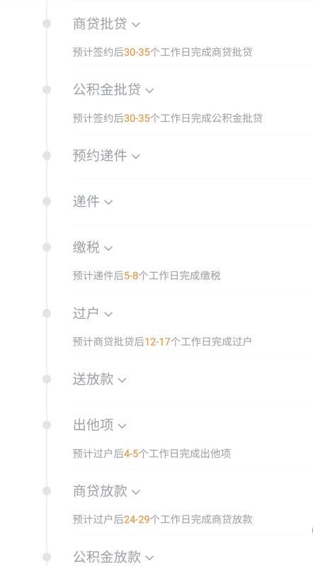

# 广州买房记
始于2020年11月份， 因为疫情原因，其它省市地区房市比较低迷， 同学陆续在武汉、苏州等都上了车。恰逢此时，房东想出售我们正在租住的房屋，让我们感受到了一些危机感，也不想再屡次搬家、忍受漂泊之感，也确实打算就在广州落下脚来，所以就开始关注广州最近的房市。相对于其它城市不同， 11月份的广州房市呈现一种逆势增长，这更加激发了心中的慌乱感，中国人普遍是买涨不买跌， 我们明知如此， 却也避免不了。我们从下定决心购买，到目前签订网签合同， 历经56天， 其中包括了入户、结婚登记、购房三个重要的时间节点，我将在下面进行详细阐述
## 入户
我们入户的是广州市天河区，流程走的是【公司集体户口】 + 【人才入户】， 像入户条件、入户材料，在这里不再赘述，主要阐述时间相关问题和实际中遇到的一些情况及处理方案。
分4个主要流程： 人才审核 ——复核——老家迁出——市内迁入
人才审核： 30天左右。
复核：依据预约时间而定，现场办理 < 1小时
老家迁出: 5天左右。 2天寄回老家， 1天办理迁出，2天寄到广州
市内迁入：依据预约时间而定， 现场办理 < 1小时
人才审核30天， 基本上是必须要等待的， 应届生有快速通道， 这个没有实际尝试过， 暂且不论。
关于天河区政务预约相关的经验：
广州市天河区政务网站 一个月只能预约3次， 之后当月不再支持预约，复核 和 入户登记 需要消耗2次， 也就是说， 我们只有一次改写的机会。
我们可以提前预约， 但是需要预估好自己手中材料准备齐全的时间， 比如预计这周可以拿到入户登记卡， 那就可以预约下周的
如果还想进一步压缩时间， 有2个取巧的办法， 不保证有效， 但我自己试的， 是可以的
1. 现场办理
入户复核是允许现场办理手续的， 但是 入户登记是不允许现场办理登记的， 所以第一种方式仅适用于入户复核。
2. 2张身份证预约
当时预约入户登记， 只有下周三、周四， 但是我入户登记卡还没有寄回， 所以为了保险起见， 我预约了下周四。但是，我第二天就拿到了入户登记卡， 所以，我将时间提前到了下周三， 然后等到这周五时， 我发现下周一、下周二放出大量入户登记名额， 于是，我想改预约时间， 但是我已经改过一次了， 这时不允许再次修改。所以，我思考了它的预约系统和入户登记系统， 如果我是政府这个系统的设计者的话， 大概率不会将预约的身份证号码和入户登记的身份证号码绑定， 至于原因， 不多说。所以， 我用我女朋友的身份证果断预约了下周一， 然后周一用我女朋友的身份证进行办理， 并且详细像工作人员解释了我的情况， 别人也理解了， 于是就直接帮我办理了入户登记。
之所以这样抢时间， 主要是因为我们当时都看中了一套房子， 房价每天都在变， 担心看上的房子被别人抢先或业主返价。不担心时间问题或户口已办理的， 大可不必这样，太操心了。。。

## 结婚登记
我想在房本上加上我女朋友的名字，所以我们就商量提前拿结婚证了。
在拿到户口之后， 我们就用手机看了一下黄历， 选了一个【宜嫁娶】的日子， 直接预约结婚登记了。过程不复杂， 到了时间点 直接过去就好。
现在不需要出9块的工本费了， 有一个2人一起朗读结婚宣言的环节， 挺有意思的。

## 购房
重点就是购买这一环节了。
### 房价预估
我们第一时间决定买房了， 首先是预估一下自己手里有多少钱，初期资金构成：
自己23万 + 父母20万 + 姐、姐夫40万 = 83 万
因为我岳父岳母刚在老家换了新房、车， 所以支援不了我们多少钱， 丈母娘打电话多次自责， 我其实觉得没什么。
我们主要目标是广州二手房市场， 因为新房价格目前实在太高， 所以不是我们这次目标。
然后， 我们决定选定一个中介机构， 因为是第一次购买， 担心被小中介坑， 所以， 我们直接选择了链家， 链家一个好处就是一次性交费，不再收取其他任何费用。当然它的中介费也比较高。
最后，计算出了我们可以购买的房子总价: 首付3成 + 税费 + 中介费(房价总价的1.5个点) = 83万 --> 75万 + 5万(个税2.5万 + 契税2.5万) + 中介费(3.75万) = 83.75万
也就是房子总价不高于250万. 

### 房子条件框定
我们大致罗列了一下我们想要买什么样的的房子, 根据需求的重要性大概做了一下分类，如下：
硬性需求：
两室一厅，面积>=60
通勤时间控制1小时以内

核心需求：
小区周边配套资源完善
中层最佳

重要需求：
较好的保值潜力
较好的学位
容积率

次要需求：
新房或准新房
朝向 非北
楼龄 5-10年

锦上添花：
知名房产公司

硬性需求不满足的， 我们不会考虑。 其它的， 根据自己做一个大概的评分标准即可。

### 区域筛选
根据硬性条件，我们需要确定一下房子的均价和选定范围：
1. 如果得房率是0.8的话, 那我们需要考虑60/0.8 = 75, 也就是75平方的两室一厅的房子, 也就是均价<=3.3万
2. 通勤时间控制在1小时内， 最长的距离肯定是以地铁作为考虑。 基本确定西到天河公园西门，东到文冲，北到科学城6号线，南不过珠江

我们租住在天河公园附近， 上班在珠江新城， 后期会搬到高塘去， 我妹子上班在黄埔大道上。 然后， 我们根据我们的条件得出以上我们想要的结果。
其实，这个范围可供我们选择的小区并不多， 每天晚上我们回来早的话， 都会在在这个区域从西到东筛选一些适合我们的小区，然后再从小区筛选出我们认为值得去线下看的房源， 最后再尝试联系中介。
在这段时间里， 我们边等待户口的审核，边寻找合适的房源， 前前后后差不多也只有2~3周的时间， 我们筛选掉了大部分区域，最后选定的区域有2个， 东圃环城高速公路附近的几个小区以及21号线苏元站附加的小区

### 实地考察
在网上筛选过程中， 我们也和不同的中介进行了沟通， 了解一下实地考察小区的具体情况。我们实地考察的具体步骤如下：
1. 到目的小区附近， 找一个看起来不错的中介机构（非链家， 因为链家是我们最后想成交的中介， 所以先找小中介探探情况）
2. 与中介沟通， 直接告诉它自己能够承受的总价是多少， 然后中介可以帮你筛选出一系列的房源
3. 真实去看一下房源， 感觉就自然会产生， 喜欢就喜欢， 一般就一般
最重要的是， 切记回来用之前罗列的条件评分， 进行复盘

### 中介选择
我们最终选择的是龙光的一套房源，因为第一次买房担心被坑， 通过咨询同学、实地带看的专业性， 我们最终还是选择了链家。

### 签订意向合同
我们是先有了意向房源， 然后再去选择哪个中介进行成交。 在选定好中介之后， 我们就开始与业主约谈意向合同，前面的流程我们自己复盘， 觉得还处理的不错， 但是在和业主谈合同的时候， 我们基本上是完败。因为我们最终的目标是买下这套我们都很喜欢的房子， 所以在谈合同时做了很多的让步。 基本就是一分钱没有还下来， 还连带着车位一次性付清。 此次交涉中， 也明白了中介在这个过程中最主要的作用是提供服务， 而不是帮买家砍价。 但是这个服务费， 着实有点贵~~~ 广州链家的买方中介费最低是房子总价的1.5%， 至于能不能接着往下谈， 就不知道了

### 网签合同、公积金贷款、商业贷款
事实上， 这三个是一起处理的。 需要注意的就是， 办理商业贷款之前， 需要明确的是：
1. 征信
2. 银行流水
3. 贷款利率
最重要的就是贷款利率了， 因为银行不同， 给到的利率也不一样。 以250万举例， 每多10BP，还款利息就会增加2.5W左右。 我们在2021年1月中旬办理的建行，20BP。已经是我们了解到的最低的了。
有一点需要注意的是， 在做商业贷款的时候， 银行可能会要求你先把首付款存到银行中， 才会给你最低的利率， 这个就要自己衡量了。我们当时在做建行的时候， 是直接申请的20BP， 在银行卡里面存了40万， 据银行工作人员说， 这样可以加快贷款审批速度

## 交易流程图

